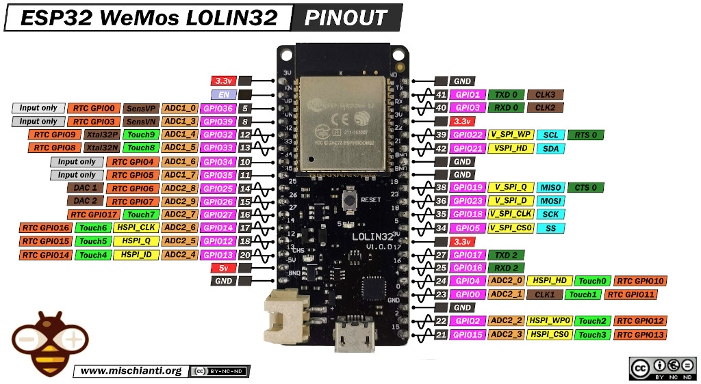

# Blink με την Micropython

## Εισαγωγή

Σ' αυτό το μάθημα, θα χρησιμοποιήσουμε την **MicroPython** για να αναβοσβήνουμε το LED που βρίσκεται πάνω στον μικροελεγκτή μας.
Για τον προγραμματισμό, θα χρησιμοποιήσουμε το Thonny IDE.

## Πώς "ανάβω" και "σβήνω" ένα LED

Ο μικροελεγκτής που θα χρησιμοποιήσουμε στο εργαστήριο είναι o ESP32 WeMos LOLIN32. Στην παρακάτω εικόνα, μπορούμε να δούμε τον μικροελεγκτή και την λειτουργία που υποστηρίζει κάθε ένας ακροδέκτης του. Παρατηρώντας την εικόνα, θα εντοπίσουμε ακροδέκτες με όνομα GPIOxx στους οποίος έχουμε την δυνατότητα να συνδέσουμε εξαρτήματα των οποίων την λειτουργία μπουρούμε να προγραμματίσουμε με την MicroPython. Επίσης, βλέπουμε ότι υπάρχουν **ακροδέκτες γείωσης (GND)** και **τάσης (3.3V)**. 

Στον συγκεκριμένο μικροελεγκτή, το ενσωμετωμένο LED είναι συνδεδεμένο στον ακροδέκτη 5 και στο παρακάτω πρόγραμμα βλέπουμε τις εντολές με τις οποίες το "ανάβουμε" και το "σβήνουμε".
```python
from machine import Pin # Get the Pin function from the machine module.
from time import sleep # Get the sleep library from the time module.

# This is the built-in green LED on the Pico.
BUILT_IN_LED_PIN = 25
# change this to the following named pin on the "W"
# BUILT_IN_LED_PIN = Pin("LED", Pin.OUT)

# The line below indicates we are configuring this as an output (not input)
led = machine.Pin(BUILT_IN_LED_PIN, machine.Pin.OUT)

# Main loop: Repeat the forever...
while True:
    led.high() # turn on the LED
    sleep(0.5) # leave it on for 1/2 second
    led.low()  # Turn off the LED
    sleep(0.5) # leave it off for 1/2 second
```